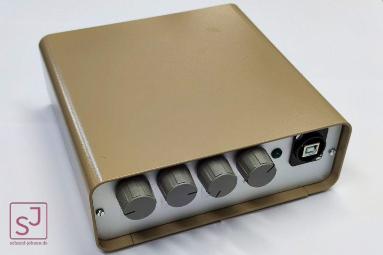
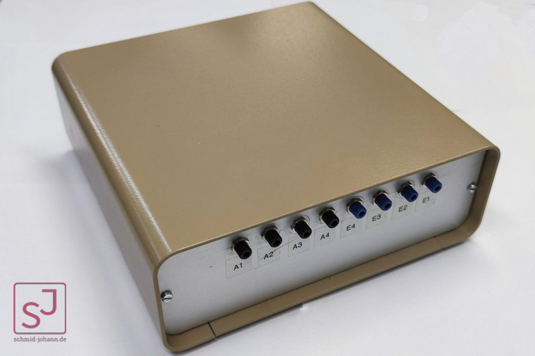

# opticalAbsorptionMeasurement
You can load the software to the project with this link
  
**[Software](https://github.com/Johann-Schmid/plotLabjack)**
  
Schematic and Board of the Optical Absorptions Measurement Device OAMD

The complete device

The complete device in a case

